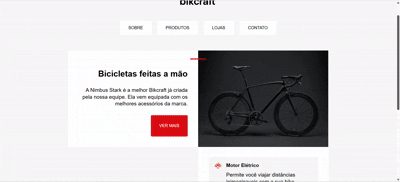

# 🚲 Bikcraft – Modo Claro e Escuro

Projeto desenvolvido como parte dos meus estudos em Front-end, baseado no layout Bikcraft do curso da plataforma Origamid.

O foco deste projeto foi a implementação de **modo claro e modo escuro**, respeitando as preferências do sistema do usuário, utilizando **CSS Variables** e a media query `prefers-color-scheme`, mantendo a identidade visual do Bikcraft.

---

## 🎥 Preview do projeto

<p align="center">
  
</p>

<p align="center">
  <em>Visualização do projeto Bikcraft nos modos claro e escuro.</em>
</p>

---

## 📝 Objetivo do projeto

Implementar suporte a **temas claro e escuro**, garantindo boa legibilidade, contraste adequado e organização do código, com foco em:

- uso de variáveis CSS
- manutenção da identidade visual
- melhor experiência do usuário
- código escalável e fácil de manter

---

## 🌗 Modo claro e escuro

O modo claro e escuro foi implementado respeitando a preferência do sistema operacional do usuário, utilizando a media query:

```css
@media (prefers-color-scheme: dark) { ... }
```

---

## 🛠️ Tecnologias utilizadas
- HTML5
- CSS3
- Visual Studio Code

---

## 📂 Estrutura do projeto

```text
bikcraft-modo-claro-escuro/
├── imagens/
│   ├── bicicleta.jpg
│   ├── bikcraft.svg
│   ├── eletrica.svg
│   ├── onda-clara.svg
│   ├── onda-escura.svg
│   ├── rastreador.svg
│   └── velocidade.svg
├── index.html
├── README.md
└── style.css