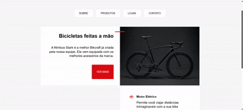

# 🚲 Bikcraft – Posicionamento

Projeto desenvolvido como parte dos meus **estudos iniciais em Front-end**, utilizando **HTML e CSS**, a partir de exercícios práticos do curso da plataforma **Origamid**.

Todo o código foi escrito por mim com o objetivo de consolidar os conceitos aprendidos, principalmente relacionados a **posicionamento de elementos**, **organização de layout** e **hierarquia visual**.

---

## 🎥 Preview do projeto

<p align="center">
  
</p>

<p align="center">
  <em>Vídeo demonstrando o layout final do projeto Bikcraft – Posicionamento.</em>
</p>

---

## 📝 Exercício proposto

O exercício consistia em criar uma página de apresentação da **Bikcraft**, utilizando apenas **HTML e CSS**, seguindo as especificações abaixo:

### 🎨 Cores

- Cinza de fundo: `#f7f7f7`
- Cinza para textos secundários: `#c6c6c6`
- Vermelho (elementos de destaque): `#ee2211`

### 🔤 Tipografia

- Fonte: **Arial**
- Tamanho dos parágrafos: **20px**
- Título “Vantagens Bikcraft”: **64px**

### 📐 Layout e posicionamento

- Conteúdo principal com largura máxima de **1000px**
- Organização do layout utilizando propriedades de posicionamento em CSS
- Alinhamento e espaçamento para criar hierarquia visual
- Uso de imagens e ícones para reforçar os diferenciais do produto

---

## 📚 Contexto do exercício

Este exercício faz parte do módulo introdutório de **HTML e CSS** do curso de Front-end da **Origamid**, com foco em:

- Posicionamento de elementos no layout
- Controle de largura máxima do conteúdo
- Criação de seções bem definidas
- Uso de cores para destaque visual
- Integração de imagens e ícones no layout
- Organização visual da página

---

## 🛠️ Tecnologias utilizadas

- HTML5  
- CSS3  
- Visual Studio Code  

---

## 📂 Estrutura do projeto

```text
bikcraft-posicionamento/
├── imagens/
│   ├── bicicleta.jpg
│   ├── bikcraft.svg
│   ├── eletrica.svg
│   ├── rastreador.svg
│   └── velocidade.svg
├── index.html
├── preview-bikcraft.mp4
├── README.md
└── style.css


