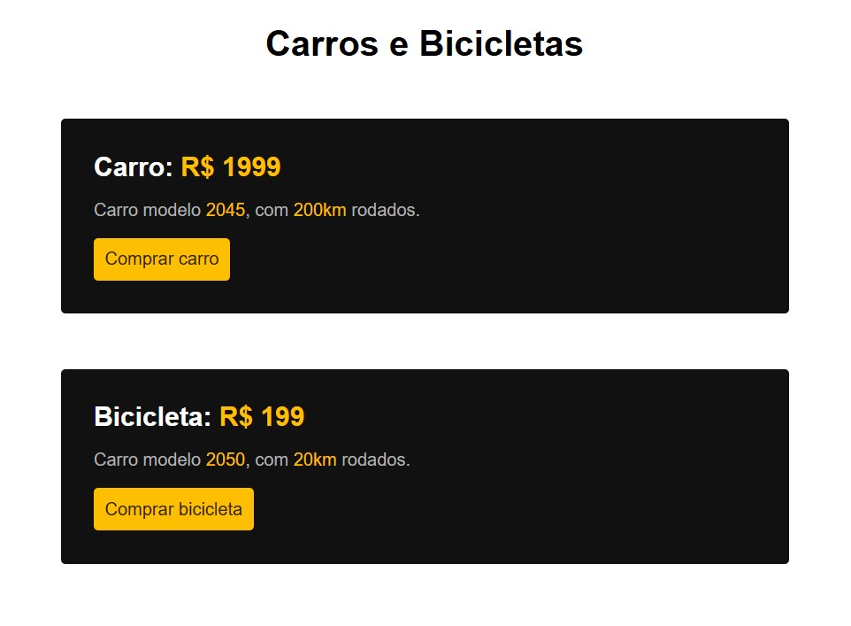

# 🛒 Produtos – Carros e Bicicletas

Projeto desenvolvido como parte dos meus **estudos iniciais em Front-end**, utilizando **HTML e CSS**, a partir de exercícios práticos do curso da plataforma **Origamid**.

Todo o código foi escrito por mim com o objetivo de consolidar os conceitos aprendidos, principalmente relacionados à **estruturação de conteúdo e estilização básica**.

---

## 🖼️ Preview do projeto

<p align="center">
  
</p>


---

## 📝 Exercício proposto

O exercício consistia em criar uma página simples de apresentação de produtos, utilizando apenas HTML e CSS, seguindo os requisitos abaixo:

### 🎨 Cores
- Amarelo 1 (preço / botão): `#febe01`
- Amarelo 2 (texto do botão): `#332200`
- Preto: `#111`
- Cinza: `#b2b2b2`

### 🔤 Tipografia
- Fonte: **Arial**
- Título principal: `h1`
- Nome do produto: `h2`

### 📐 Estilização
- Alinhar textos ao centro: `text-align: center`
- Arredondar bordas: `border-radius: 4px`

### 🧾 Conteúdo da página
- Título principal: **Carros e Bicicletas**
- Produto 1:
  - **Carro: R$ 1999**
  - Carro modelo 2045, com 200km rodados.
- Produto 2:
  - **Bicicleta: R$ 199**
  - Bicicleta modelo 2050, com 20km rodados.

---

## 📚 Contexto do exercício

Este exercício faz parte do módulo introdutório de **HTML e CSS** do curso de Front-end da **Origamid**, com foco em:

- Uso correto de títulos (`h1`, `h2`)
- Aplicação de cores no CSS
- Tipografia básica
- Alinhamento de textos
- Estilização de elementos com bordas arredondadas
- Organização de um layout simples

---

## 🛠️ Tecnologias utilizadas

- HTML5  
- CSS3  
- Visual Studio Code  

---

## 📂 Estrutura do projeto

```text
produtos/
├── index.html
├── style.css
├── preview.jpg
└── README.md

